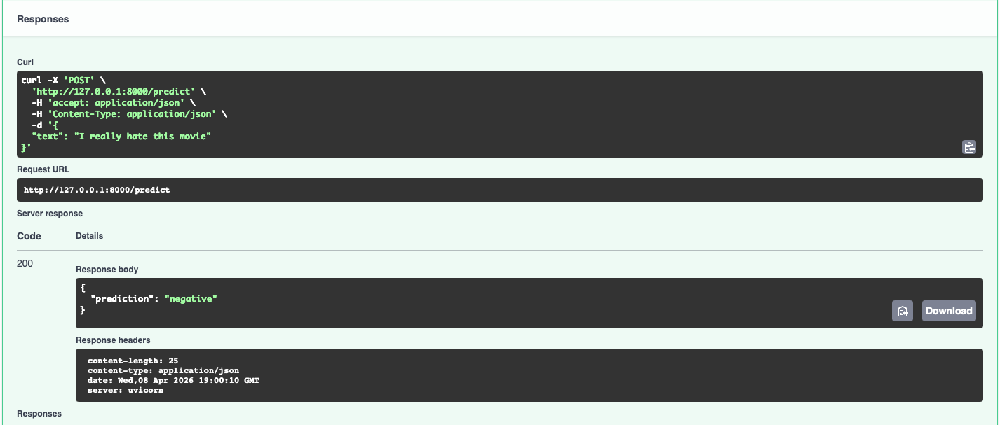

# Sentiment Analysis API

This project exposes a FastAPI endpoint for sentiment prediction.

The model pipeline is:

1. input text
2. Sentence Transformer embedding
3. logistic regression classifier
4. output sentiment label as a string: `negative`, `neutral`, or `positive`

## Requirements

- Python 3.12+
- `uv` installed

## Install dependencies

From the project root:

```bash
uv sync
```

## Run the app
```bash
uv run uvicorn api.app:app --reload
```

### The app will be available at:

http://127.0.0.1:8000

Swagger UI: http://127.0.0.1:8000/docs

### Test case 1: positive sentiment
```bash
curl -X POST "http://127.0.0.1:8000/predict" \
  -H "Content-Type: application/json" \
  -d '{"text":"I love this product, it works great."}'
  ```
Expected class:
```bash
{
  "prediction": "positive"
}
```

### Test case 2: negative sentiment
```bash
curl -X POST "http://127.0.0.1:8000/predict" \
  -H "Content-Type: application/json" \
  -d '{"text":"This was a terrible experience and I want a refund."}'
```
Expected class:
```bash
{
  "prediction": "negative"
}
```

### Test case 3: neutral sentiment
```bash
curl -X POST "http://127.0.0.1:8000/predict" \
  -H "Content-Type: application/json" \
  -d '{"text":"The package arrived yesterday and I have opened it."}'
```
Expected class:
```bash
{
  "prediction": "neutral"
}
``` 

### Example:

